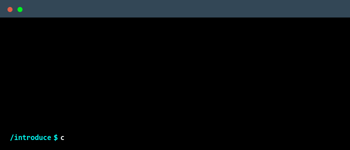

  

 

  

    

  
  
  
  
  
  
  

<h4 align="center">
  Hủy diệt thế giới này đi ae.
</h4>

<table align="center" width="100%">
  <tr>
    <td align="center">
      
    </td>
    <td align="center">
      
    </td>
  </tr>
</table>

## 🛠 Kỹ lăng kỹ lăng
<table width="100%" align="center">
  <tr>
    <td align="center"> Arch</td>
    <td align="center"> Linux</td>
    <td align="center"> Java</td>
    <td align="center"> Bash</td>
  </tr>
  <tr>
    <td align="center"> C++</td>
    <td align="center"> Proxmox</td>
    <td align="center"> Python</td>
    <td align="center"> MySQL</td>
  </tr>
</table>

## Dự án
- **Nghiên cứu Zero Trust**: Phát triển mô hình Behavior-Adaptive Least Privilege (BALP).
- **Home Lab**: Vận hành phòng Lab SOC trên Proxmox.

## Liên hệ ở đây

  
  
  

  

